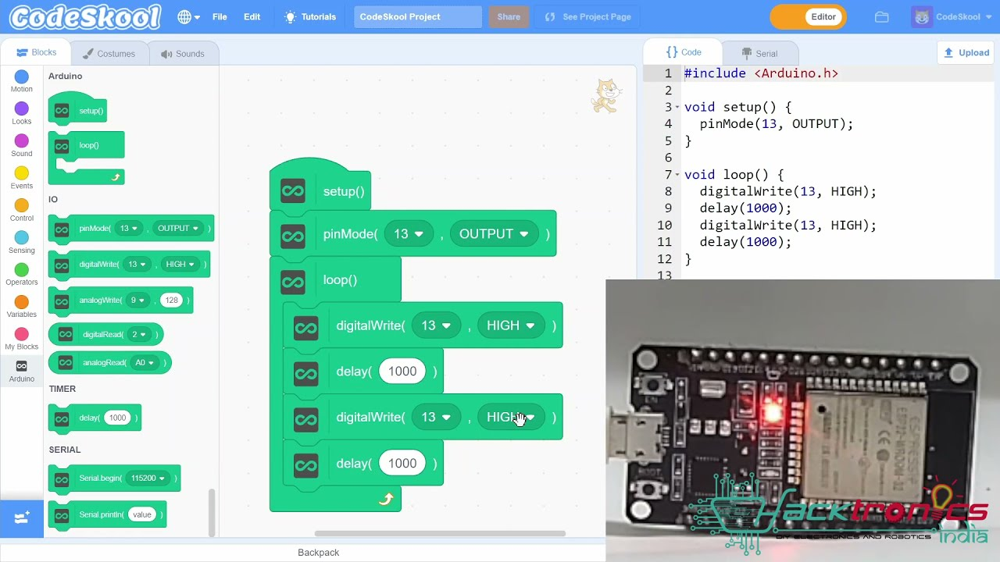
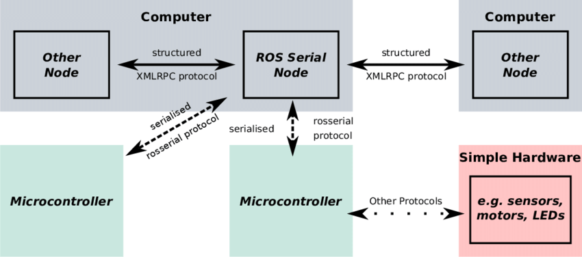
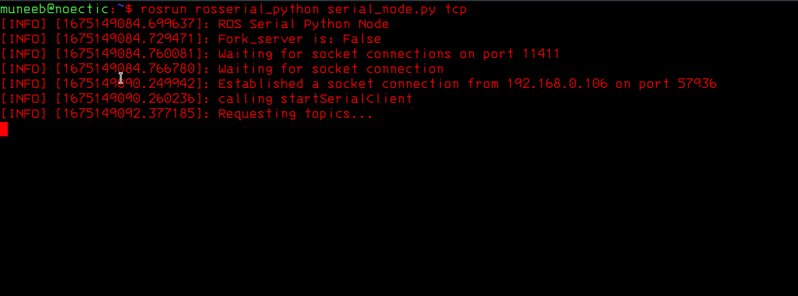
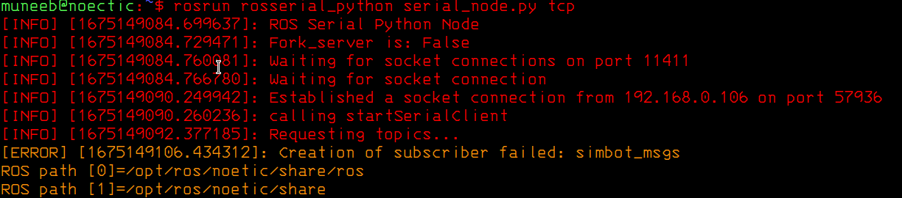
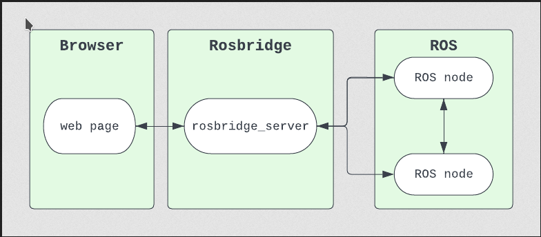

# 				Chapter 01: ROS on SIMBOT				                 

## 									SIMBOT Hardware

### What is SIMBOT?

SimBot is an open Hardware/ Open Source miniature robotic platform that has been developed by [BrainSwarm](http://brainswarms.com/) and is primarily focused to be used in swarm robotics research, and teach robotics and STEM Education at K-12. 

#### SimBot Hardware Specifications:

**Specifications List:**

- 80 mm in diameter
- 2 x DC Motors 
- 2 x Hall Effect Encoders
- 5 x IR transmitter / receivers
- 3.7 Volts Battery with USB  Type - B Charging Port
- Communication Pins for Tx / Rx, PWM etc.

**Microcontroller:** ESP32 Wroom 32 Dev Kit v1

**Motors:** JGA12 - N20 (3V DC Motors) with Encoder

**Sensors:** SimBot is equipped with 5 forward facing infrared sensors for obstacle avoidance

SIMBOT v1 is equipped with ESP32 Microcontroller (ESP32 is a series of low-cost, low-power system on a chip microcontrollers with integrated Wi-Fi and dual-mode Bluetooth). Integration of Wireless capability in SimBot enhances its potential for many remote applications.

#### Interfacing Additional Sensors with SIMBOT

SIMBOT v1 is also capable of carrying add on boards to enhance its functionality. Additional boards may include, Arduino Nano, Raspberry Pi Zero, Nano Pi Neo etc. 

#### Potential Use Cases

**Block Coding**

Miniature robotic platforms, such as SIMBOT, can be used for STEM education and research primarily research in Swarm Robotics domain. At first ever RoboSTEM Winter Camp, SIMBOT was introduced to school students, where they programmed SIMBOT using block based coding tool, called SCRATCH.



SIMBOT can be hard programmed for simple tasks such as LED Blink if close to obstacle. Move a certain distance or move to goal, through block coding.

**SIMBOT Playing Soccer**

<video style = "height: 510px; width: 500px;" src="./assets/images/vlc-record-2023-01-31-00h45m04s-day4.mp4-.mp4"></video>

In the above example, SIMBOT is controlled wirelessly through web interface.

### SIMBOT Interfacing with ROS

#### What is ROS?

ROS (Robot Operating System) is a middleware which works as a communication bridge between low level robotic platform (SIMBOT) and high level programming language (Python, C++ etc.), using ROS, programmers, roboticist and developers can combine their code together without worrying about programming language or underlying communication protocol.

ROS essentially provides communication layer between multiple systems. Those systems can be two computers, computer and Robot, or robot and robot.

#### ROS on SIMBOT

In our particular example, multiple SIMBOTs can be connected to single ROS server, this will be achieved through client / server architecture. ROS should be installed on computer. Refer to Chapter 02 for ROS installation instructions.

##### Flashing Latest Firmware in SIMBOT

Get the latest firmware from [this Repo](https://github.com/munn33b/simbot-ros). Next we need to flash this latest firmware into SIMBOT.

**Steps:**

- Install Python Package Installer

```
sudo apt install python3-pip
```


- Install esptool

```
sudo pip3 install esptool
```


- Go to Firmware Directory and run

```
esptool.py -p <PORT> -b 460800 --before default_reset --after hard_reset --chip esp32  write_flash --flash_mode dio --flash_size detect --flash_freq 40m 0x1000 build/bootloader/bootloader.bin 0x8000 build/partition_table/partition-table.bin 0x10000 build/simbot_control_teleop.bin
```

Replace <PORT> with Port you want server to listen on.

Now at this stage, we are all set to wirelessly connect SIMBOT to ROS, in this particular example SIMBOT with act as Client.

##### ROS Serial Introduction

ROS Serial is a communication protocol to interface ROS with microcontrollers such as ESP32 and Arduino. First we need to install ROS Serial into system (ROS must be already installed).

```
sudo apt install ros-noetic-rosserial-python
```





ROS Serial works on client / server based architecture, the server is running on ROS enabled computer, while ROS Serial Client is already enabled on latest SimBot Firmware.

##### Connecting SIMBOT to ROS using ROS Serial

First we need to start the ROS serial server on Computer, run on one terminal

```bash
roscore
```

and in other terminal, run

```bash
rosrun rosserial_python serial_node.py tcp 11411
```

This will start TCP server which listens on port 11411. You can also change the port that server listens on, but in the SIMBOT firmware, default port is 11411 and cannot be manually changed by user for now.

After that, switch on the SIMBOT, after some time, SIMBOT will connect to ROS Server and following message will appear on terminal screen.

 

And if you see message as below, you may need to source your ROS Workspace again and make sure simbot_msgs is inside ROS Workspace, src directory.

Clone github repository inside your catkin workspace.

```bash
git clone https://github.com/munn33b/simbot-ros.git ~/catkin_ws/src
```

Then change directory into your workspace, and run

```bash
catkin build
```

Then source your catkin workspace using following command

```bash
source ~/catkin_ws/devel/setup.bash
```



Now, we are done with setup, next we need to connect to our robot (SIMBOT) remotely using web interface.

#### TeleOp SIMBOT using Web Interface

The web interface to interact with SIMBOT is also publicly available. The web interface connects to ROS Interface using ROS Bridge Server. So to run Web Interface, ROS Bridge server must be installed on computer along with ROS.

```bash
sudo apt install ros-noetic-rosbridge-server
```

Once it is installed, user can start ROS Bridge server using following command

```bash
roslaunch rosbridge_server rosbridge_websocket.launch
```

Then run the web interface. The SIMBOT Web Interface looks like this,


The controls for SIMBOT Teleop are as follows

1. **w:** Forward
2. **a:** Left
3. **s:** Backward
4. **d:** Right

Make sure you are connected to server before sending these commands. ROS Bridge server must be running to "connect to Server", also SIMBOT must be connected to ROS Interface through ROS Serial Protocol.

##### ROS Bridge Server

ROS Bridge server serves as an intermediate layer between ROS Interface and web client languages, primarily Javascript. ROS Bridge allows non ROS systems to communicate with ROS Interface.

Using ROS Bridge, user can send commands from web interface, running on any computer or other device to the ROS interface over the internet. This tool can be very beneficial for remotely controlling robots from anywhere. The general architecture of ROS Bridge server is, as shown.

